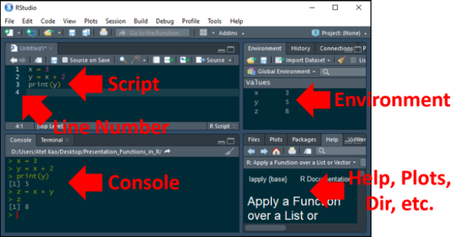
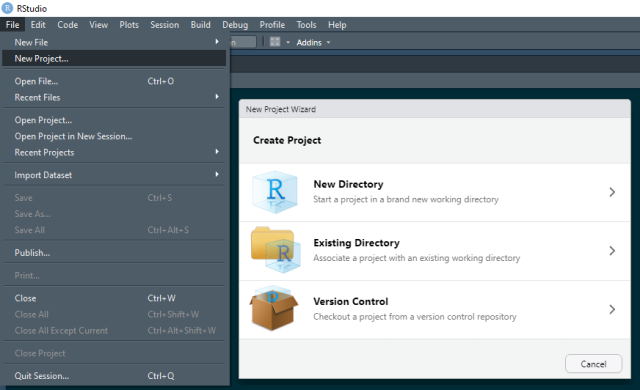
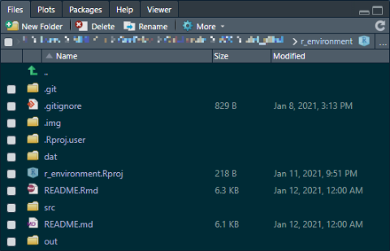
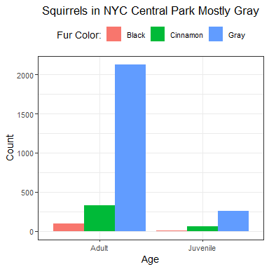

<a name="setting-up-an-r-development-environment"></a>

# [atet](https://github.com/atet) / [***r\_environment***](https://github.com/atet/rmd_tutorial#setting-up-an-r-development-environment)

[](#nolink)

# Setting Up An R Development Environment

**Objectives**:

  - Setup development environment
  - Best practices for project organization
  - Experience full product life cycle

-----

<a name="table-of-contents"></a>

## Table of Contents

  - [Software Installation](#software-installation)
  - [Prerequisites](#prerequisites)
  - [Navigating RStudio](#navigating-rstudio)
  - [Projects and Organization](#projects-and-organization)
  - [Development Workflow](#development-workflow)
  - [Next Steps](#next-steps)
  - [Acknowledgments](#acknowledgments)

-----

<a name="software-installation"></a>

## Sofware Installation

R language and RStudio installed locally in your development
environment: [Instructions from
RStudio](https://rstudio.com/products/rstudio/download/#download)

[**Back to Top**](#table-of-contents)

-----

<a name="prerequisites"></a>

## Prerequisites

1.  [Introduction to
    R](https://github.com/atet/learn/blob/master/programming/README.md#atet--learn--programming)
2.  [Common tasks in
    R](https://github.com/atet/rmd_tutorial#r-markdown-for-github-with-intermediate-r-tutorial)

[**Back to Top**](#table-of-contents)

-----

<a name="navigating-rstudio"></a>

## Navigating RStudio



> NOTE: These default panes can be rearranged to your preference

1.  **Console/Terminal** - See console output, run single commands, and
    use command line interface (CLI)
2.  **Scripts** - Multiple scripts can be open and worked on
3.  **Environment** - Lists all objects in memory
4.  **Files/Plots/Packages/Help**

[**Back to Top**](#table-of-contents)

-----

<a name="projects-and-organization"></a>

## Projects and Organization

The exploratory data analysis paradigm will generate many files:
Projects, exported data, reports, visualizations, etc.

### R Projects

You can start organizing distinct tasks by using **R Projects**:



By opening RStudio through an `*.Rproj` file, you ensure that the proper
working directory is set for that project.

Multiple R Projects can be opened simultaneously; each project will have
its own instance of RStudio.

### Organizing Files



Your main operating code could be in a single `main.R` or within an
executable R Markdown document (`*.Rmd`).

Supporting code could be organized into one or more scripts in `./src`.

Outputs such as figures and/or reports could go in `./out`

Local data can be organized into `./dat`.

> NOTE: If you don’t intend to version control large data files, make
> sure you ignore them in `.gitignore`

### Version Control

Multiple options:

  - Integrated into RStudio: Tools ► Version Control
  - Desktop client: SourceTree, git-gui, etc.
  - CLI
  - *No version control*

[**Back to Top**](#table-of-contents)

-----

<a name="development-workflow"></a>

## Development Workflow

***You’ve been tasked to visualize information about all the squirrels
in NYC’s Central Park<sup>[\[1,2\]](#acknowledgments)</sup>***

1.  Create a new R Project
2.  Create a folder `./dat` to hold data and `./out` for output
3.  Create a new R Script
4.  Copy the following code into the script

<!-- end list -->

``` r
# 1. Load packages
install.packages("ggplot2") # Install package
library(ggplot2)            # Load package into environment

# Load data
df = read.csv("https://data.cityofnewyork.us/resource/vfnx-vebw.csv")
nrow(df)
# 1,000 observations, this seems off.. this API requires a token for all of the data...

df = read.csv("https://raw.githubusercontent.com/rfordatascience/tidytuesday/master/data/2019/2019-10-29/nyc_squirrels.csv")
nrow(df)
# 3,023 observations, that's more like it

# Save source data locally
write.csv(df, "./dat/nyc_squirrels.csv", row.names = FALSE)

# Remove all NAs or "?" for column $age
df = df[!is.na(df$age) & df$age != "?",]

# Remove all NAs for column $primary_fur_color
df = df[!is.na(df$primary_fur_color),]

# Save cleaned data locally
write.csv(df, "./dat/nyc_squirrels_CLEAN.csv", row.names = FALSE)

# Visualize proportions of squirrels by $age and $primary_fur_color
plot_draft = ggplot(df, aes(fill = primary_fur_color, x = age)) + 
                geom_bar(position="dodge", stat="count")

# Adjust figure
plot_final = plot_draft + theme_bw() +
                labs(title = "Squirrels in NYC Central Park Mostly Gray", x = "Age", y = "Count", fill = "Fur Color:") +
                theme(plot.title = element_text(hjust = 0.5), legend.position = "top")

# Save figure to disk
png("./out/AK_20210111_figure01.png", width = 384, height = 384, units = "px", res = 92)
  print(plot_final)
dev.off()
```

4.  Execute the code line-by-line (`CTRL+Enter`) or press `Run` on the
    upper-right of the Scripts pane.
5.  Marvel at your finished product:



[**Back to Top**](#table-of-contents)

-----

<a name="next-steps"></a>

## Next Steps

  - [Functions in R: Theory, Practice, and
    Applications](https://github.com/atet/learn#computer-science)
  - [Data Visualization in R: Theory, Practice, and
    Applications](https://github.com/atet/learn#data-science)

[**Back to Top**](#table-of-contents)

-----

<a name="acknowledgments"></a>

## Acknowledgments

1.  NYC Squirrel Census from the City of New York:
    <https://data.cityofnewyork.us/Environment/2018-Central-Park-Squirrel-Census-Squirrel-Data/vfnx-vebw>
2.  NYC Squirrel Census compiled by R for Data Science:
    <https://github.com/rfordatascience/tidytuesday/tree/master/data/2019/2019-10-29>

[**Back to Top**](#table-of-contents)

-----

<p align="center">Copyright &copy; 2020-&infin; <a href="https://www.athitkao.com" target="_blank">Athit Kao</a>, <a href="https://www.athitkao.com/tos.html" target="_blank">Terms and Conditions</a></p>

-----
